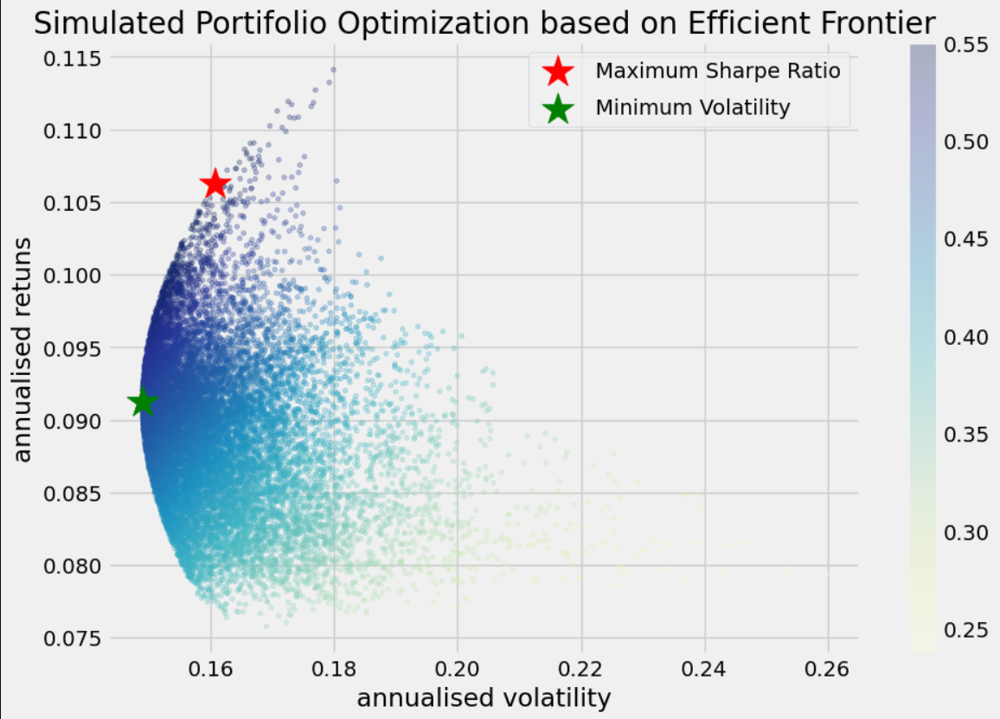

# Portfolio-Optimazation-Markowitz
One of the most fundamental principles of Quantitative Finance is Modern Portfolio Theory, developed by Harry Markowitz, which revolutionized the way investors allocate their assets. The focus of this theory is to find the ideal balance between risk and return through intelligent diversification.

📚 What is Modern Portfolio Theory? It proposes that, by combining assets with different correlations, it is possible to build a portfolio that maximizes the expected return for a given level of risk or minimizes the risk for a target return. The key point is efficient diversification.

Depending on the correlation of the assets in the portfolio and their composition, it’s possible to increase expected return and decrease risk, thus balancing the portfolio more effectively. By combining assets that respond differently to market changes, total volatility is reduced, enabling more stable and predictable growth.

Using Python, it's possible to model different investment portfolios and simulate various possible combinations, making the portfolio optimization process much more practical and accessible. Below are the main advantages of this approach.

Results Example:

